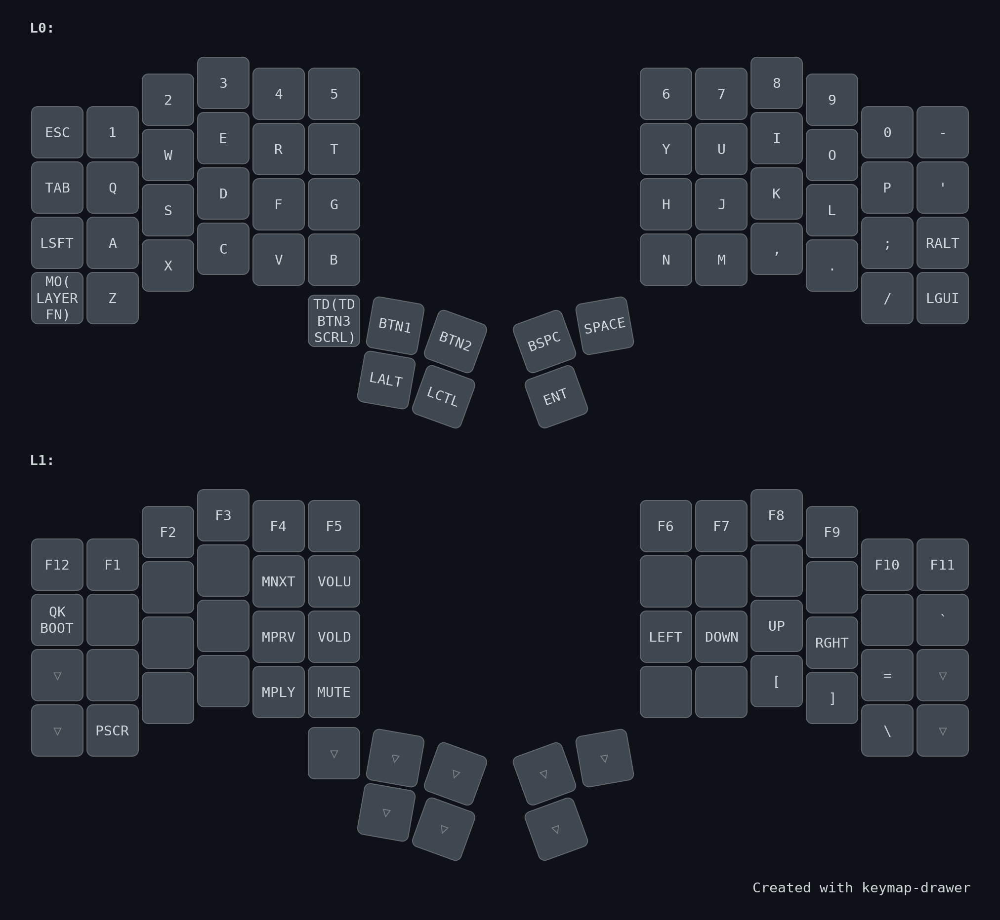
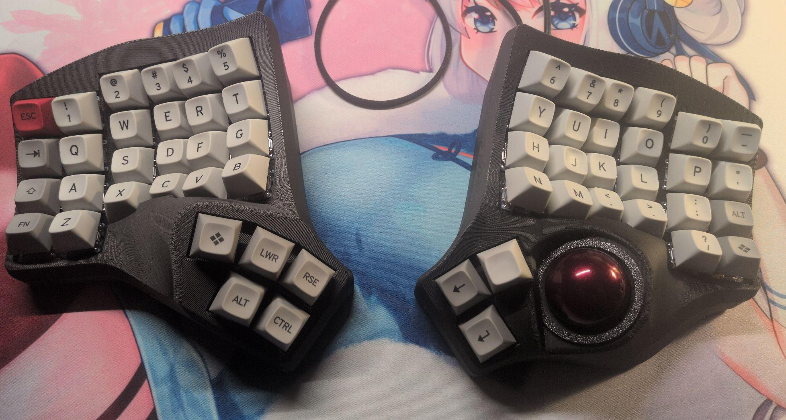

# QMK Userspace

This is the QMK Userspace for the Bastard Keyboards keymaps.

You can read how to compile your own keymap on the official docs here: [https://docs.bastardkb.com/fw/compile-firmware.html](https://docs.bastardkb.com/fw/compile-firmware.html).

# Keymap

This fork contains my personal keymap for my keyboard. I recommend using the `altgr-intl` variant of the `us` xkb layout.
See `keyboards/bastardkb/charybdis/4x6/keymaps/caem`.

